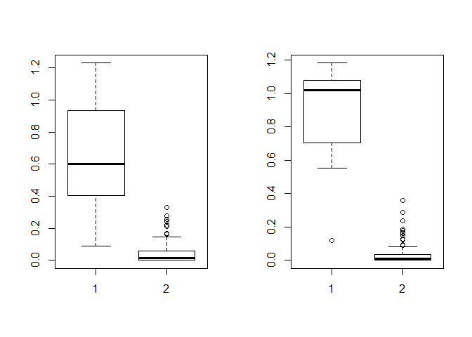

Low rank representation of binary matrix is powerful in disentangling sparse individual-attribute associations, and has received wide applications. Existing binary matrix factorization (BMF) or co-clustering (CC) methods often assume i.i.d background noise. However, this assumption could be easily violated in real data, where heterogeneous row- or column-wise probability of binary entries results in disparate element-wise background distribution, and paralyzes the rationality of existing methods. We propose a binary data denoising framework, namely BIND, which optimizes the detection of true patterns by estimating the row- or column-wise mixture distribution of patterns and disparate background, and eliminating the binary attributes that are more likely from the background. BIND is supported by thoroughly derived mathematical property of the row- and column-wise mixture distributions. Our experiment on synthetic and real-world data demonstrated BIND effectively removes background noise and drastically increases the fairness and accuracy of state-of-the arts BMF and CC methods.

``` r
source("function.R")

# simulate a 100 by 100 matrix that has one pattern and background
Simu<-MAT_Generate(Size = 100)  
MAT<-Simu[[1]]
VEC_r<-Simu[[2]]
VEC_c<-Simu[[3]]

Prob_r<-apply(MAT,2,mean)
Prob_c<-apply(MAT,1,mean)

# get empirical row/column wise probability
E_r<-Empirical_generate(Prob_r)
E_c<-Empirical_generate(Prob_c)

# get weight by quantile shift
Weight_r<-apply(MAT,1,KS_dist,Prob=Prob_r,Empi=E_r)
Weight_c<-apply(MAT,2,KS_dist,Prob=Prob_c,Empi=E_c)

# visulize the difference between pattern and non-patterns columns/rows
par(mfrow=c(1,2))
boxplot(Weight_r[VEC_r],Weight_r[setdiff(1:length(Weight_r),VEC_r)])
boxplot(Weight_c[VEC_c],Weight_c[setdiff(1:length(Weight_c),VEC_c)])
```



The BIND denoising framework is accepted by CIKM 2020. The preprint can be access here[https://arxiv.org/abs/2007.15816]
